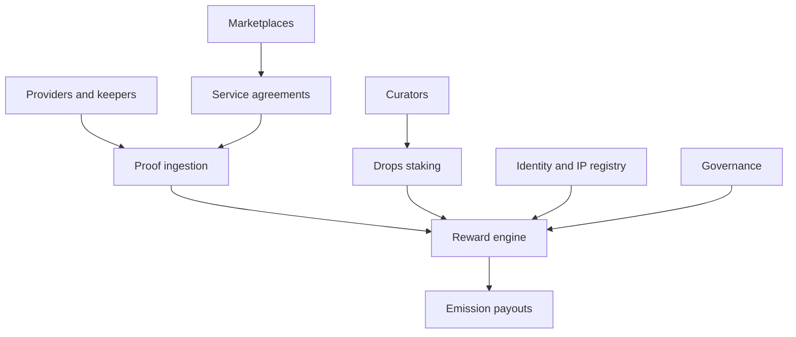

# Veridrop

**Source:** `ai-in-decentralized+ai/openminedOcean Protocol Technical Whitepaper/`
**Domain:** `ai-decentralized`
**One-liner:** A control plane for AI data and service networks that pays block rewards only when cryptographic proofs of delivery match curated stake on relevance — so spam supply cannot farm incentives.
**Wedge:** Operators of multi-marketplace ai-data networks (AV fleet data pools, medical compute-to-data consortia, public commons programmes) that need to incentivise availability without centralised quality police.
**Positioning:** Where Tidecove-class exchanges sell access, Veridrop runs the Proofed Curation Market underneath: predicted relevance via staking on “drops,” actual relevance via proofs of availability/compute, and rewards only at the intersection. It is the integrity and incentive kernel, not the buyer-facing catalogue.

## Market research synthesis

### Thesis from source

Ocean’s technical whitepaper frames the same macro asymmetry — data-and-AI power concentrated in firms that hold both — but focuses on the hard incentive problem: how a network knows what is *relevant*, how it rewards commons as well as priced assets, how it includes privacy-preserving compute, and how it stops spam, “data escapes,” and fake delivery. The proposed construction is a **Curated Proofs Market (CPM / Proofed Curation Market)** with two halves: (1) cryptographic proof of actual popularity (count of provable deliveries — e.g. proof of data availability or zero-knowledge compute proofs), and (2) a curation market for predicted popularity where actors stake Ocean tokens to buy dataset/service-specific “drops” on a bonding curve. Block rewards flow to stakeholders who both staked early on what becomes popular *and* made the service provably available. Service agreements, access control, identity TCRs, COALA IP provenance, and third-party arbitration sit around that core.

Use cases force the design: AV training may need 500B–1T miles (RAND); pooling across automakers needs many marketplaces on one substrate, not a new silo; medical Parkinson’s research with ConnectedLife/NNI Singapore cannot copy raw patient data, so privacy-preserving compute must be first-class; ImageNet-scale commons need incentives to keep contributing. Stakeholders include providers, referrers/curators, consumers, keepers, and regulators. The differentiating insight for a product is not “decentralized storage” but **separating predicted relevance (stake) from verified delivery (proof)** so economic rewards cannot be farmed by publishing junk or claiming deliveries that never occurred.

### Buyer & economic model

- **Primary buyer:** Protocol / network operator or foundation engineering lead responsible for incentive correctness; secondary buyer is a consortium CIO running a private Ocean-like network for industry data pooling.
- **Users:** keeper operators, service providers (data and compute), curators/stakers, marketplace integrators, security auditors, governance participants.
- **Budget owner / value metric:** network sustainability budget and integrity SLA. Value metric is % of rewards paid only against verified proofs, spam publish rate, and mean time to detect fake availability.
- **Competing status quo:** manual curation committees; naive token rewards for “upload count”; centralized marketplace quality teams; unverifiable off-chain delivery logs.

### Domain constraints

- **Regulatory / trust / safety:** proofs must not leak regulated payloads; identity TCR and arbitration must support real disputes; protocol upgrades need governed rollout (bugs in incentive code are existential).
- **Data sensitivity:** medical and proprietary AV data stay on-prem; proofs attest delivery/compute without exporting raw records.
- **Change-management realities:** keepers will game bonding curves and reward schedules; Sybil downloads, curation clones, and “Elsa & Anna” style attacks named in the paper require continuous monitoring, not one-time design.

## Business requirements

- BR-1: No block reward may be paid for a service period without a linked cryptographic delivery or availability proof accepted by network policy.
- BR-2: Curators must stake to obtain drops in a specific asset/service; early correct stake must earn disproportionately vs late stake, per published bonding-curve parameters.
- BR-3: Predicted popularity (drops) and actual popularity (proof counts) must both be visible so operators can explain why a reward was paid or withheld.
- BR-4: Service agreements between consumer and provider must be machine-enforceable for access grant/revoke and delivery acceptance.
- BR-5: Privacy-preserving compute jobs must be first-class services with integrity proofs distinct from bulk data download proofs.
- BR-6: Identity participation for reward-earning roles must pass a registry policy (TCR or equivalent) sufficient to raise Sybil cost.
- BR-7: IP attribution and provenance for assets must be recorded so “data escape” republication of another’s asset can be challenged.
- BR-8: Failed or fraudulent proofs must slash or withhold stake with an auditable reason code.
- BR-9: Commons (zero-price) assets must remain eligible for proofed rewards so free supply is not starved relative to priced supply.
- BR-10: Operators must be able to pause reward emission for a service class during an active exploit without deleting historical proofs.
- BR-11: Third-party arbitration outcomes on IP or delivery disputes must bind entitlement and reward state.
- BR-12: Parameter changes to bonding curves and reward schedules must be versioned and effective only after a published governance delay.

## User stories

Canonical user stories live in sibling [USER_STORIES.md](USER_STORIES.md).

## System design

### Overview

Veridrop is the control plane for a Proofed Curation Market. Providers register services (data availability, compute). Curators stake into per-service drops. Consumers invoke services under agreements; keepers produce proofs of delivery/availability/compute integrity. A reward engine combines proof counts with drop balances to allocate emissions. Identity registry, IP provenance, and arbitration feed eligibility. Marketplaces consume ranking signals; they do not own the incentive state.

### Actors & boundaries

- **Actors:** network operator, keeper, data/compute provider, curator, consumer (via marketplace), arbitrator, auditor.
- **Trust boundary:** raw data stays with providers; Veridrop trusts proofs and registry state, not payload content. Reward keys and slash authority sit behind operator + governance controls.
- **Human-in-the-loop points:** arbitration; emergency pause; registry challenges; parameter governance votes.

### Core capabilities

1. **Service registry** — data and compute services with proof-type requirements.
2. **Curation staking (drops)** — bonding-curve stake/un-stake per service.
3. **Service agreements & access control** — grant, revoke, accept delivery.
4. **Proof ingestion & verification** — availability, replication, compute integrity.
5. **Reward allocation** — emissions from proofed popularity × stake.
6. **Identity TCR / participant registry** — Sybil-costly roles.
7. **IP provenance & arbitration hooks** — COALA-style attribution and dispute binding.
8. **Governance & circuit breakers** — parameter versions, emission pauses.

### Conceptual data

- **Primary entities:** Service, DropPosition, StakeEvent, ServiceAgreement, DeliveryProof, RewardEpoch, Participant, ProvenanceRecord, ArbitrationCase, ParameterVersion.
- **Critical events:** service registered, stake opened/closed, agreement formed, proof accepted/rejected, reward paid, stake slashed, emission paused, arbitration resolved.
- **Retention / audit needs:** proofs, stake history, and reward epochs retained for the full incentive audit window; payloads never stored.

### Integrations (conceptual)

- **Systems of record:** marketplace catalogues, provider storage/compute clusters, identity KYC providers, on-chain or ledger settlement rails.
- **Upstream signals:** proof verifier services (PoST/PoRep/ZK), IP registries, reputation oracles.
- **Downstream actions:** reward payouts, access grants, slash notifications, marketplace rank updates.

### High-level architecture

### Success metrics

- **Leading:** proof acceptance rate; % rewards with dual stake+proof linkage; median proof verification latency; Sybil challenge volume.
- **Lagging:** spam service rate; slash rate; curator ROI dispersion; downtime of rewarded services; successful arbitration closures.

## OpenAPI skeleton

Canonical HTTP surface lives in sibling `openapi.yaml`. Summarize here:

- **Base path:** `/v1/...`
- **Auth:** API key and/or Bearer JWT (operator)
- **Resource groups:** Services, DropPositions, ServiceAgreements, DeliveryProofs, RewardEpochs, ArbitrationCases
