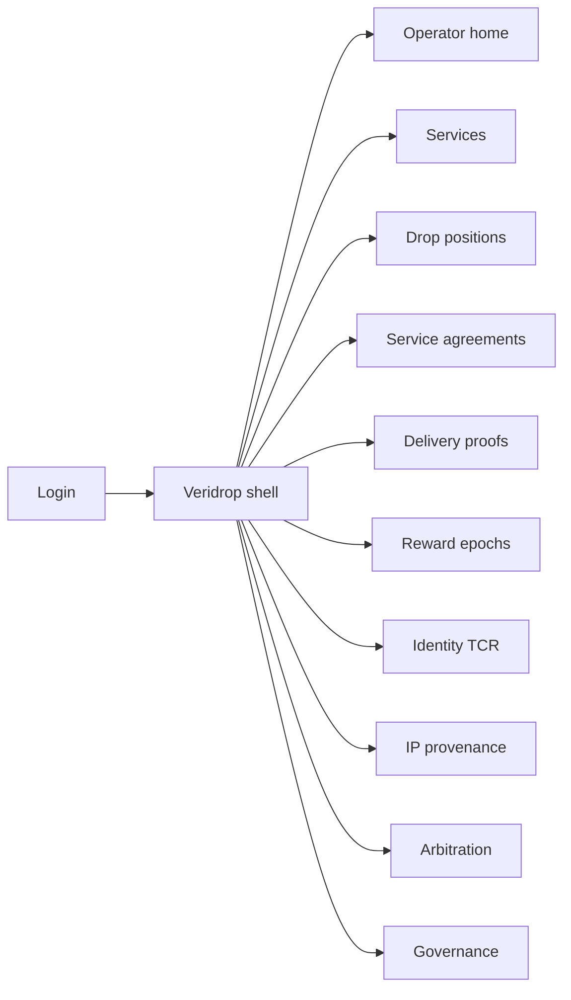
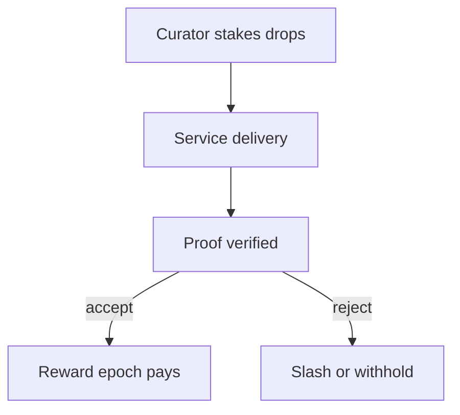

# Veridrop — Web app

**Product:** [PRODUCT.md](./PRODUCT.md)
**Primary surface:** Proofed Curation Market control plane (network operator + keeper/curator consoles)
**Secondary surfaces:** Marketplace integrator ranking API browser (read signals); arbitrator dispute desk
**Design thesis:** Veridrop is an incentive kernel — rewards fall only where stake predicted relevance *and* cryptographic proofs verified delivery. The UI metaphor is a dual rain gauge: one tube for drops (curation stake), one for proofs (delivery); emissions pour only when both read high. Visual language is storm-slate and proof-violet-ink avoided in favour of electric-teal proof ticks and stake-gold on deep night water: spam services look dry; slashed stakes look scorched coral; paused emissions feel like a closed sluice. The Veridrop wordmark sits as a quiet drop-mark on every reward screen so operators know whose emission schedule they are trusting — this is not a buyer catalogue.

## UX research synthesis

### Category peers (best-in-class)

- **Filecoin / Storage Provider UIs:** Proof of replication/spacetime with slash visibility. Steal: proof accept/reject with reason codes next to rewards (BR-1, BR-8); reject “upload count” farming dashboards.
- **The Graph Indexer / Curator portals:** Stake on subgraphs, query fees, disputes. Steal: predicted relevance via stake vs actual usage signals side-by-side (BR-3); reject treating stake alone as quality.
- **EigenLayer / restaking operator consoles (pattern):** Emission pauses and parameter versioning. Steal: circuit-breaker pause without deleting history (BR-10); governance delay on parameter changes (BR-12).
- **Kleros / arbitration panels (pattern):** Dispute outcomes binding on-chain state. Steal: arbitration updates entitlement and reward eligibility (BR-11).

### Patterns to adopt / reject

- **Adopt:** Dual view stake×proof; bonding-curve drop positions; service agreements; availability vs compute integrity proof types; commons eligible for proofed rewards; identity TCR; IP provenance challenges; slash with reason; emission pause; versioned parameters.
- **Reject:** Rewards for publish count; buyer-facing dataset store as home; hiding why a reward was withheld; unversioned curve edits; purple “AI token” vanity; proofs that leak payloads.

### Trust, density, and workflow constraints from PRODUCT.md

No emission without accepted proof (BR-1). Early correct stake earns disproportionately on published bonding curves (BR-2). Operators must explain paid vs withheld via dual signals (BR-3). Privacy-preserving compute proofs are first-class (BR-5). Sybil-costly identity for reward roles (BR-6). Data-escape republication challengeable via provenance (BR-7). Commons not starved (BR-9). Incentive bugs are existential — pause and governance delay required (BR-10, BR-12). Density is kernel-ops: epochs, proofs, stakes — not GMV shopping carts.

## Information architecture

### Nav model

### Roles → default home

| Role | Default home | Why |
|------|--------------|-----|
| Network operator | Operator home | Emission integrity and pauses (BR-1, BR-10) |
| Keeper / provider | Delivery proofs | Submit availability/compute proofs |
| Curator / staker | Drop positions | Bonding-curve stake (BR-2) |
| Marketplace integrator | Services (signals) | Rank by verified relevance |
| Auditor | Reward epochs | Dual stake+proof trail |
| Arbitrator | Arbitration | Bind entitlement/reward (BR-11) |

### Cross-links to OpenAPI resources

| Nav area | OpenAPI tags / resources |
|----------|---------------------------|
| Services | Services |
| Drop positions | DropPositions |
| Service agreements | ServiceAgreements |
| Delivery proofs | DeliveryProofs |
| Reward epochs | RewardEpochs |
| Arbitration | ArbitrationCases |

## Screen inventory

### Operator home

- **Purpose:** Answer “are emissions proof-gated, and is any proof type compromised?” in one composition.
- **Entry:** Operator login default.
- **Layout regions:** Brand + network; % rewards with dual stake+proof linkage; spam publish rate; emission pause switches by proof class; slash volume; governance delay queue.
- **Primary actions:** Pause emission class; open epoch; open exploit incident.
- **Empty / loading / error:** Empty network = register first service; pause active = sluice banner.
- **BR / story ties:** BR-1, BR-3, BR-10.

### Service registry

- **Purpose:** Register data availability and compute services with required proof types.
- **Entry:** Nav → Services; provider register.
- **Layout regions:** Service table; proof-type requirements; commons vs priced flag; ranking signal preview for marketplaces.
- **Primary actions:** Register service; set proof policy; suspend spam service.
- **Empty / loading / error:** Missing proof type = cannot earn rewards.
- **BR / story ties:** BR-1, BR-5, BR-9.

### Drop staking (curation)

- **Purpose:** Stake into per-service drops on bonding curve; early correct stake earns more.
- **Entry:** Curator default.
- **Layout regions:** Curve chart; position list; stake/un-stake under published rules; predicted vs actual popularity sparklines.
- **Primary actions:** Open stake; un-stake; compare proof counts.
- **Empty / loading / error:** Curve param version badge always visible.
- **BR / story ties:** BR-2, BR-3.

### Dual rain-gauge detail

- **Purpose:** Explain why a reward paid or withheld — drops vs proofs on one screen.
- **Entry:** From service or epoch row.
- **Layout regions:** Stake gauge; proof gauge; intersection highlight; withhold reason codes.
- **Primary actions:** Export explanation; open slash event.
- **Empty / loading / error:** N/A.
- **BR / story ties:** BR-3.

### Service agreements

- **Purpose:** Machine-enforceable consumer–provider agreements for access grant/revoke and delivery acceptance.
- **Entry:** Integrator / provider.
- **Layout regions:** Agreement list; access state; delivery acceptance; revoke.
- **Primary actions:** Form agreement; revoke access; accept delivery.
- **Empty / loading / error:** No agreement = proofs not reward-linked for that consumer path.
- **BR / story ties:** BR-4.

### Delivery proof inbox

- **Purpose:** Ingest and verify availability, replication, or compute-integrity proofs without payload leak.
- **Entry:** Keeper default.
- **Layout regions:** Proof queue; verifier status; accept/reject with reason; latency SLA.
- **Primary actions:** Submit proof; retry; view slash risk.
- **Empty / loading / error:** Reject = coral reason; never show raw regulated payload.
- **BR / story ties:** BR-1, BR-5, BR-8.

### Reward epochs

- **Purpose:** Allocate emissions from proofed popularity × stake; audit trail for board.
- **Entry:** Operator / auditor.
- **Layout regions:** Epoch list; allocation table; dual-linkage %; commons share; payout status.
- **Primary actions:** Close epoch; export audit; clawback on fraud.
- **Empty / loading / error:** Paused class excluded with sluice label.
- **BR / story ties:** BR-1, BR-9.

### Identity TCR

- **Purpose:** Raise Sybil cost for reward-earning roles.
- **Entry:** Registry nav.
- **Layout regions:** Participant roles; stake-to-list; challenges; eligibility for rewards.
- **Primary actions:** Apply; challenge; approve role.
- **Empty / loading / error:** Non-listed cannot earn (BR-6).
- **BR / story ties:** BR-6.

### IP provenance and data-escape

- **Purpose:** Record attribution; challenge republication of another’s asset.
- **Entry:** Provenance nav; challenge CTA.
- **Layout regions:** Provenance graph; escape challenge queue; impact on reward eligibility.
- **Primary actions:** File challenge; attach evidence; await arbitration.
- **Empty / loading / error:** N/A.
- **BR / story ties:** BR-7, BR-11.

### Arbitration desk

- **Purpose:** Bind IP/delivery dispute outcomes to entitlement and reward state.
- **Entry:** Arbitrator login; from challenge.
- **Layout regions:** Case queue; evidence panes; outcome → entitlement/reward update preview.
- **Primary actions:** Decide; apply binding update; notify parties.
- **Empty / loading / error:** Empty = no open cases.
- **BR / story ties:** BR-11.

### Governance and circuit breakers

- **Purpose:** Version bonding curves and reward schedules with published delay; pause emissions on exploit.
- **Entry:** Gov nav; emergency.
- **Layout regions:** Parameter versions; delay countdown; pause controls by service/proof class; history retained.
- **Primary actions:** Propose param change; execute after delay; pause/resume emission.
- **Empty / loading / error:** Immediate silent param edit blocked.
- **BR / story ties:** BR-10, BR-12.

### Marketplace signal browser

- **Purpose:** Read-only proof and stake signals for catalogue ranking — not a storefront.
- **Entry:** Integrator API browser UI.
- **Layout regions:** Service signals; verified relevance score; embed docs.
- **Primary actions:** Copy API snippet; filter commons.
- **Empty / loading / error:** N/A.
- **BR / story ties:** Marketplace integrator stories; BR-3.

## Key flows

1. **Proofed reward** — stake drops → service delivers → proof accepted → epoch allocates at intersection; no proof = no pay.

2. **Compute integrity path** — privacy job → integrity proof type → accept without raw export → eligible for rewards (BR-5).

3. **Emission pause** — exploit detected → pause proof class → historical proofs retained → resume after fix (BR-10).

4. **Data-escape challenge** — provenance mismatch → arbitration → bind reward/entitlement (BR-7, BR-11).

5. **Parameter change** — propose curve/schedule → governance delay → version effective; no silent edit (BR-12).

## Design system

### Tokens (CSS variables)

- `--color-ink: #E6EEF2` — primary text
- `--color-night-950: #070B10` — app ground
- `--color-night-900: #101820` — panels
- `--color-mist: #8A9AAB` — secondary labels
- `--color-proof: #2AD4C9` — proof accepted (electric-teal)
- `--color-stake: #D4A84B` — drop stake gold
- `--color-amber: #E0A12B` — provisional / delay
- `--color-coral: #E85D4C` — slash / reject
- `--color-sluice: #5C6B7A` — emission paused
- `--color-brand: #7FE3DA` — Veridrop wordmark
- `--font-display: "JetBrains Mono", "IBM Plex Mono", monospace` — kernel titles (monospace-led integrity)
- `--font-body: "IBM Plex Sans", sans-serif`
- `--font-mono: "JetBrains Mono", monospace` — proof ids, epoch hashes
- `--space-1`…`--space-8`: 4px scale
- `--radius-sm: 2px`; `--radius-md: 6px` — sharp kernel aesthetic
- `--motion-drop: 180ms ease-out` — stake fill
- `--motion-proof: 200ms ease-out` — proof tick
- `--motion-sluice: 300ms ease-in` — pause dim
- Atmosphere: night-water grain; dual-gauge motif; no marketplace hero photography; no purple token glow.

### Typography & brand

- Mono display for epoch and proof titles (integrity kernel); sans for operator prose.
- Brand drop-mark left of chrome on reward and proof screens; never replaced by “Dashboard.”
- Login: brand hero, one headline (“Stake predicts. Proofs pay.”), one CTA.

### Do / don’t

- **Do:** Always show stake×proof; reason-code rejects; pause without history wipe; version parameters; commons reward eligibility.
- **Don’t:** Purple AI glow; rewards on upload count; payload previews in proof UI; silent curve edits; catalogue shopping as home.

### Accessibility & domain trust cues

- AA+ proof/stake/coral on night; pause uses sluice icon + “Emission paused” text.
- Live regions for slash, pause, and arbitration outcomes.
- Focus order: service → stake → proof → epoch → gov.
- Epoch exports machine-readable for foundation audit.

## Component patterns

- **DualRainGauge** — stake vs proof with intersection pay zone.
- **BondingCurveStakePanel** — versioned curve stake/un-stake.
- **ProofVerdictRow** — accept/reject + reason code.
- **EmissionSluiceSwitch** — pause by proof/service class.
- **RewardEpochTable** — dual-linkage allocations.
- **IdentityTcrCard** — Sybil-costly role listing.
- **ProvenanceEscapeChallenge** — data-escape case seed.
- **ArbitrationBindingPreview** — entitlement/reward impact before decide.
- **ParameterDelayCountdown** — governance timelock.
- **MarketplaceSignalChip** — verified relevance for integrators.

## Out of scope for v1 web

- Buyer-facing data catalogue (Tidecove/Quayside); fiat checkout UX; full ZK prover IDE; keeper hardware provisioning; mobile staking app; DEX token trading charts as primary surface.
